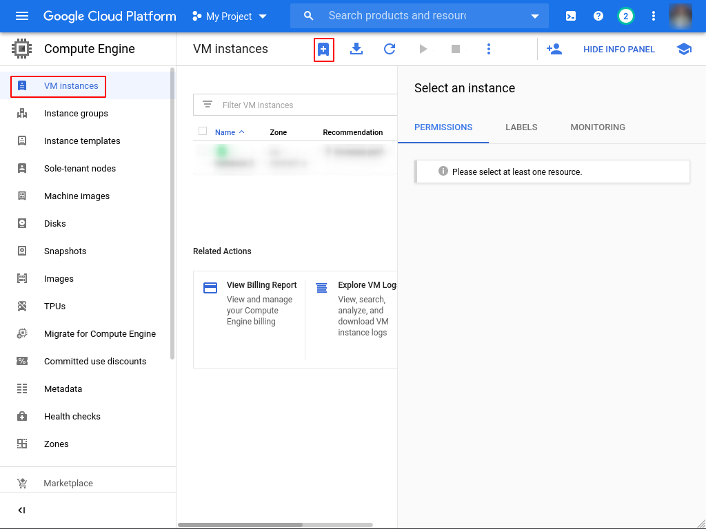
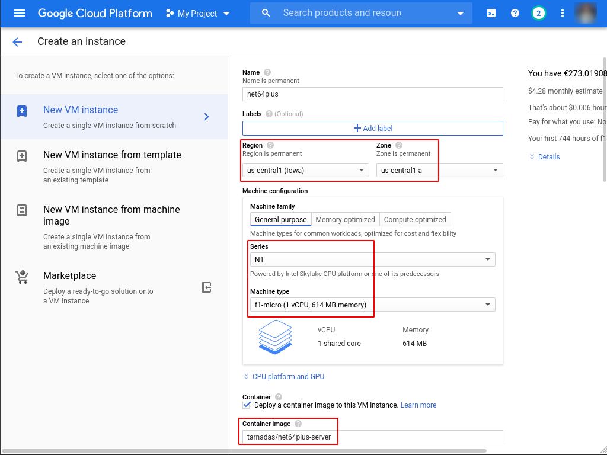
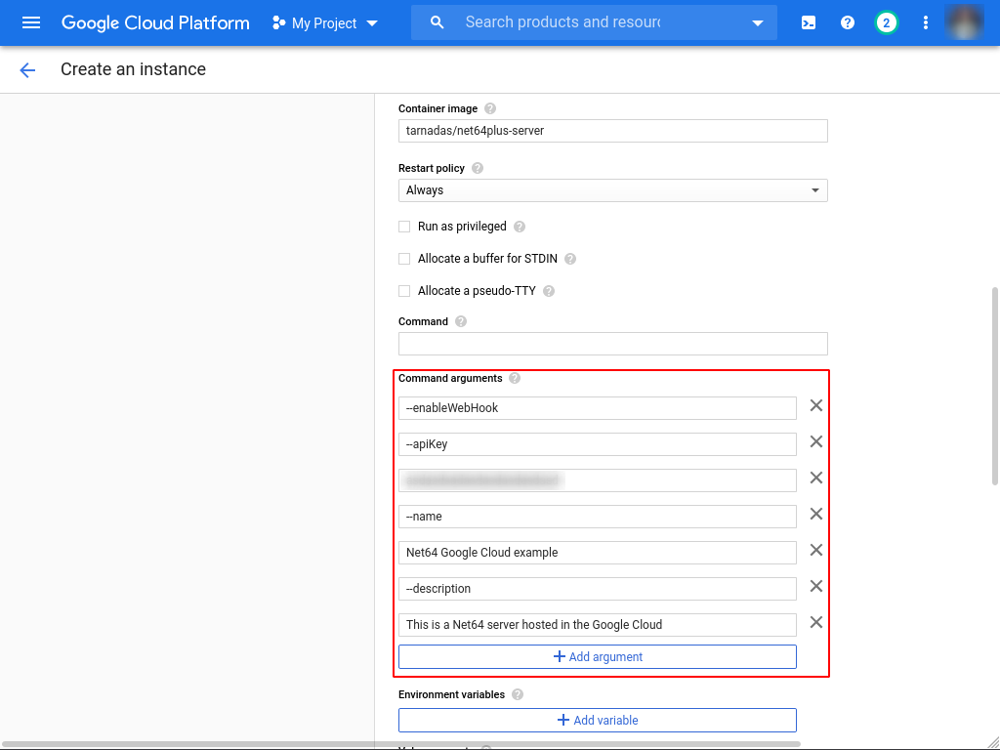

This guide shows how to run a dedicated server with Docker.
You can use this method instead of installing the server with Node, which might be preferable depending on your setup.

Docker also allows you to easily host Net64 on a Cloud Compute Engine of your choice.

## Docker

[Net64+ Server](https://hub.docker.com/r/tarnadas/net64plus-server) can be found on Docker Hub.

Make sure that [Docker is installed](https://docs.docker.com/get-docker/) and running.
Then execute the following commands:

```bash
$ docker run --rm -it -p 3678:3678 tarnadas/net64plus-server
$
$ # or run it detached in background
$ docker run --rm -it -d -p 3678:3678 tarnadas/net64plus-server
```

You will still need to port-forward in order for this to work.

The Docker Container accepts all arguments that the regular Net64+ Server executable accepts as well.

```bash
Optional arguments:
  -h, --help            Show this help message and exit.
  --port PORT, -P PORT
  --gamemode GAMEMODE, -g GAMEMODE
  --disableGamemodeVote, -G
  --passwordRequired, -pr
  --password PASSWORD, -p PASSWORD
  --name NAME, -n NAME
  --domain DOMAIN, -D DOMAIN
  --description DESCRIPTION, -d DESCRIPTION
  --enableWebHook, -w
  --apiKey APIKEY, -k APIKEY
  --verbose, -v
  --skipPortCheck, -s
```

An example to host a public server on port 8080:

```bash
$ docker run --rm -it -d -p 8080:8080 tarnadas/net64plus-server -P 8080 -w -k $API_KEY -n "Public Net64+ Server" -d "This is a publicly hosted Net64+ Server"
```

## Google Cloud example

Google Cloud offers a [free tier](https://cloud.google.com/free) for their compute engine, which will let you run a Net64+ server for free.
Please check their website for exact conditions about their free tier and pricing.

To use any of the cloud providers you will at least need a credit card, which must be used as billing method in case of extended usage.

1. Go to [Google Cloud Console](https://console.cloud.google.com) and setup a billing account and create a new project.


2. Under "VPC Network / Firewall" you will have to setup a new Firewall rule to let the default port of Net64 pass through your Container.


3. Set up the rule with the settings given in the screenshot.


4. Navigate to "Compute Engine / VM Instances" and create a new project.



5. Make sure that your settings match the marked settings in the screenshot to stay in the free tier. You can alternatively select a more powerful instance or another region. For the first year, you get a 300\$ discount, which should be more than enough. Also enter "tarnadas/net64plus-server" as Container image.



6. Under "advanced container options", you need to actually configure the arguments with which your Net64 server will run. The screenshot shows an example how to host a public server.



7. Hit the "Create" button at the very bottom and wait for your VM to startup. It should soon be displayed in the [Net64 server list](/servers).

8. If your server doesn't seem to show up, you can check your server logs by establishing a SSH connection after selecting your VM instance.


