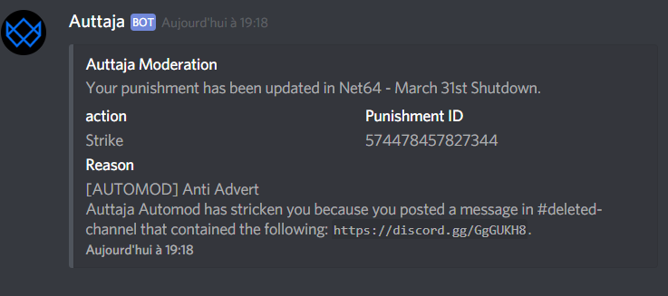

If you haven't yet noticed, Net64 is going through a hard time and we, the developers, want to explain what is going on.

If you try to join our partnered Discord server at [discord.gg/net64](https://discord.gg/net64) or visit our subreddit [r/Net64](https://reddit.com/r/Net64) you'll notice that both of our community platforms have been shutdown.

This was started by our former discord server owner on the 23rd of March when he informed the moderation team and the developers about his plan to leave the server. But instead of resigning and transfering ownership to another person he decided to delete the server.
To this day we don't fully understand his motivation for the shutdown and we weren't able to convince him of a different solution. Because as the owner he had full control over the server he began shutting down several channels and eventually made a public announcement about the planned deletion on the 31st of March. Shortly after we found ourselves banned from the server and blocked by it's owner. Users who tried to inform other members about our replacement server got banned.

This seems like a clear indication that said admin just wanted to damage the community as much as possible by abusing his power and our trust.
On March 26th he decided to prematurely delete this server as a result of various members sharing the new invite.

We think his actions are disrespectful to the rest of the team as well as to the members of the server. Such a decision should be discussed extensively with the whole team and not be made within one day by a single person because of a bad mood.
It could have been a few clicks to just give ownership to someone else.
Instead we now have to regroup and form a new community.

If you are still interested in the development of Net64 and its successor you can join our new Discord server here:

We hope you will still follow the project and what we have to show off in the future.

Best Regards,

The Net64 Team
