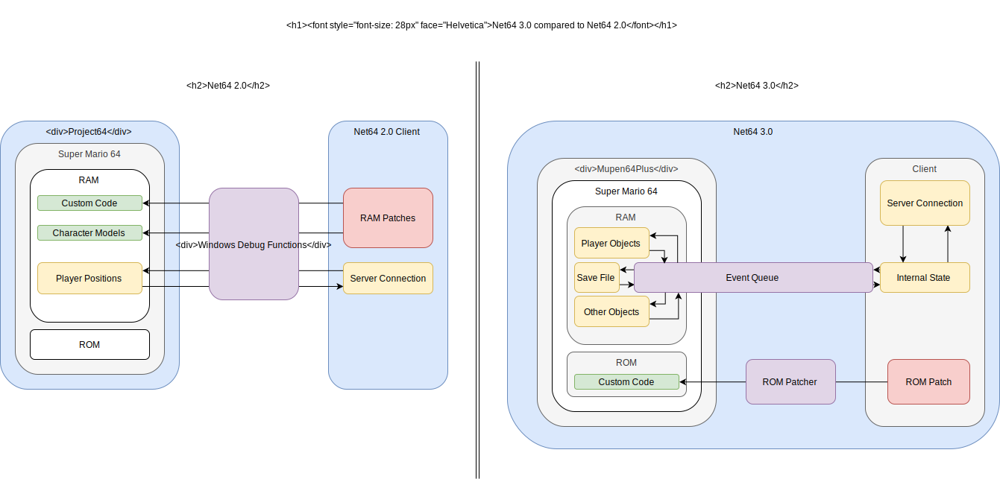

## Contents
- <a href="#current-state">The Current State Of Net64</a>
- <a href="#the-plan">The Plan</a>
- <a href="#net64_3">Net64 3.0</a>
- <a href="#technicalities">The Technicalities</a>
- <a href="#caveats">Any Caveats?</a>

---

<h2 id="current-state"> The Current State Of Net64</h2>

You probably noticed that updates to anything regarding Net64 have become increasingly sparse and even if they happen they usually do not contain many changes. This is still the aftermath of Kaze (the initial developer) leaving Net64 over a year ago. Since then his part of the Net64 codebase has remained unchanged since it is not documented and we couldn't find anyone who is able to work on it. Either Kaze's code is crap or we're not enlightened enough to understand it. Either way we're not able to build on it further.

---
<h2 id="the-plan">The Plan</h2>

Being stuck to using Kaze's code without being able to modify it to incorporate new features or more importantly fix existing bugs is a major setback for us. To regain control over the Net64 codebase we decided it is time for a fresh start. Yes, you heard that right. We're rewriting Net64 from scratch.

---
<h2 id="net64_3">Net64 3.0</h2>

If you're a member of our [discord](https://discord.gg/GgGUKH8) you probably heard of the new Net64 version dubbed as the "coop version". This is the work in progress rewrite of Net64. A lot of things are different about it. More attention to the more technical differences between this and the existing version of Net64 will be given later in this post but here's a broad overview of what Net64 3.0 is doing differently: We want to sync every intereactable object in the game. That means you no longer play in separate worlds where only the player models can interact with each other but be able to cooperatively interact with the environment. If a player collects a coin it disappears for everyone. The coin counter will increment for everyone and if this was the 100th coin to be collected in the course a star will appear for everyone. We're also changing the way the client works. Instead of launching Project64 and Net64 and then hoping Net64 detects the emulator the new client *is* the emulator. This reduces the amount of problems users have when trying to setup Net64 and gives us greater control over Super Mario 64. The new client also works on 32bit Windows and Linux. If a talented macOS user would like to help us out a macOS version of the client would be possible as well.

Of course syncing every object in Super Mario 64 is going to take quite a while. To not keep you waiting the whole time we're planning to publish a demo in the near future. The demo will contain a single fully synced course. The development of the rewrite has been opened up. The development channel is public on our discord so everyone interested in the development can follow it or paricipate in it.

---
<h2 id="technicalities">The Technicalities</h2>

We now told you what we want to do. Now it's time for telling you *how* we're going to do it. So here's a short summary of the technical differences between the current version of Net64 and Net64 3.0. Note that most of these changes are invisible to you as a user but instead allow us to do more advanced stuff with Super Mario 64.

<h4 id="rom-hack">ROM-Hack Not RAM-Hack</h4>

You probably know that Net64 just requires a copy of stock Super Mario 64 (US Version) to work. But where do the player models and custom abilities come from? Well, instead of modifying the ROM like traditional ROM-hacks Net64 inserts models and custom code into the N64's RAM. This has the advantage of not requiring modifications to the ROM and being relatively simple to program. The disadvantages however are that it sometimes simply doesn't work, it might require loading a savestate and it doesn't allow us to modify everything in Super Mario 64. As we think the disadvantages of a RAM-hack outweigh the positives we decided to develop a ROM-hack for the rewrite.

<h4 id="no-asm">No Assembly</h4>

Traditionally Super Mario 64 modifications are developed in MIPS assembly. Like pretty much all assembly languages MIPS requires extensive knowledge of the underlying CPU architecture.
To make development easier for us we are going to use the C programming language for Super Mario 64 related logic. This not only makes the code easier to maintain but because C is a lot more widespread than MIPS it also allows more people to join the development.

<h4 id="embedded-emulator">An Embedded Emulator</h4>

Currently Net64 and the emulator (in our case Project64) are two separate programs. Net64 uses Windows functions to act like a debugger for Project64 so that it can access Super Mario 64's memory. This has been an easy solution since we can rely on Project64 to do most of the work (controller mapping, window creation, etc). Sadly this approach is very unreliable. In fact most people who try to play Net64 fail at this exact step. To counter this problem we embedded the popular Mupen64Plus emulator into the new client. It is now a single program so you just have to join a server and the emulator automatically starts Super Mario 64. There are plenty of benefits of doing it this way but the usability aspect alone makes this the superior solution.

<video autoplay loop>
  <source src="../images/news/start_emulator.mp4" type="video/mp4">
  Your browser does not support video.
</video> 

<h4 id="interface">A Reliable Interface Between Client And Game</h4>

To make the more advanced synchronization work we need a good way of telling Super Mario 64 about events that happened to a remote player. For example where players are, which objects are synced, when a player joins, if an object was interacted with and many other things. This sounds easier than it actually is. Don't forget that Super Mario 64 normally doesn't even know there is something like a client or even the internet in general. Currently the client just reads the local player's position (and some other properties) from a fixed location and writes the remote players' positions at another fixed location. For what Net64 currently does this is sufficient. For more elaborate internet play this solution will fall apart. Syncing non player objects requires more than just sending positions around. Objects are created, modified and destroyed all the time in Super Mario 64 and all those events have to reach the remote players. With the current solution those events could be missed accidentally or be sent twice to every player. The players would graduately desync over time. To prevent this we created a protocol that ensures events (or messages as they are internally called) are received perfectly in order and without getting lost or magically doubling. It's like a network tunnel from Super Mario 64 to the Net64 client.

<video width="427" height="519" autoplay loop>
  <source src="../images/news/coin_star_collecting.mp4" type="video/mp4">
  Your browser does not support video.
</video> 

Super Mario 64 sending coin collected messages into the client's console.

---
So here's an overview of the architectural changes between Net64 2.0 and Net64 3.0:

---
<h2 id="caveats">Any Caveats?</h2>

Yes. Unfortunately there are a two features of Net64 2.0 that we're not planning to port to Net64 3.0 in the foreseeable future. These features are romhack support and custom characters. Now before you send us into GBJ for doing that listen to us. We have good reasons to do so:

Unlike just syncing player positions full object syncing requires every object to be treated differently. We can do this for stock Mario 64 but not for every possible romhack out there. When we're done syncing the core game we might contact the developers of some popular romhacks to help us make them work in Net64 3.0 as well but it's a long bumpy ride until then so please don't ask us which romhack will get support before we even released a playable demo.

Custom characters would theoretically be possible but every character model that doesn't exist in stock SM64 would need to be shipped with Net64. We are legally not allowed to do this and since we want to stay on the safe side with Net64 3.0 we'll refrain from doing so.

---
- You can join our discord to stay updated on the development of Net64 3.0 [here](https://discord.gg/GgGUKH8).
- Or have a look at the Net64 3.0 source code on [GitHub](https://github.com/net64-mod/net64-coop).
- Note: The existing Net64 2.0 server list will obviously stay online.
